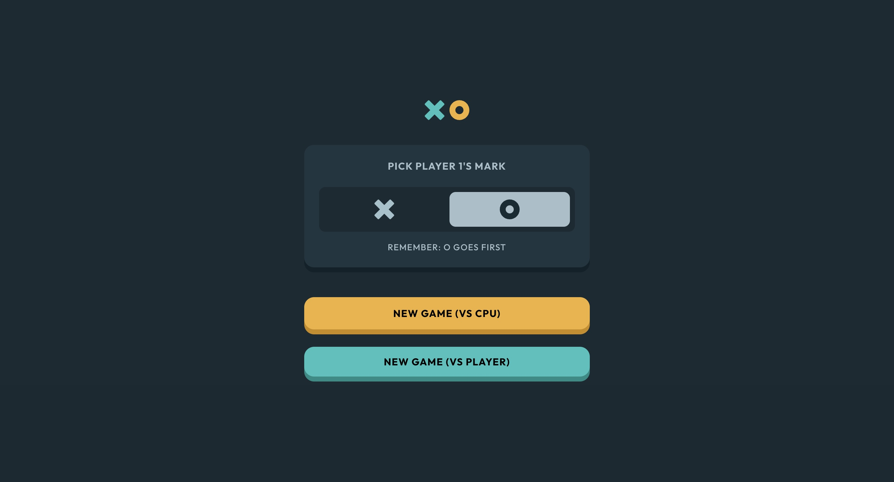

# Frontend Mentor - Tic Tac Toe solution

This is a solution to the [Tic Tac Toe challenge on Frontend Mentor](https://www.frontendmentor.io/challenges/tic-tac-toe-game-Re7ZF_E2v). Frontend Mentor challenges help you improve your coding skills by building realistic projects.

## Table of contents

-   [Overview](#overview)
    -   [The challenge](#the-challenge)
    -   [Screenshot](#screenshot)
    -   [Links](#links)
-   [My process](#my-process)
    -   [Built with](#built-with)
    -   [What I learned](#what-i-learned)
    -   [Continued development](#continued-development)
-   [Author](#author)

## Overview

### The challenge

Users should be able to:

-   View the optimal layout for the game depending on their device's screen size
-   See hover states for all interactive elements on the page
-   Play the game either solo vs the computer or multiplayer against another person
-   **Bonus 1**: Save the game state in the browser so that it’s preserved if the player refreshes their browser
-   **Bonus 2**: Instead of having the computer randomly make their moves, try making it clever so it’s proactive in blocking your moves and trying to win

### Screenshot



### Links

-   Solution URL: [https://github.com/Joshk7/tic-tac-toe-vanilla](https://github.com/Joshk7/tic-tac-toe-vanilla)
-   Live Site URL: [https://tic-tac-toe-vanilla-ten.vercel.app/](https://tic-tac-toe-vanilla-ten.vercel.app/)

## My process

### Built with

-   Semantic HTML5 markup
-   CSS custom properties
-   Flexbox
-   CSS Grid
-   Mobile-first workflow

### What I learned

I wanted to try creating this project from pure HTML, CSS, and JavaScript. Initially, I started with the HTML creating the basic elements that I wanted for the main menu and board game. Then I styled the project with CSS. From there, I mapped out the JavaScript variables that would hold different states for the board.

```js
let original = "O";
let player = "O";
let isSingle = true;
let isPlaying = false;
let isComputer = false;
const boardState = ["", "", "", "", "", "", "", "", ""];
let x = 0;
let o = 0;
let tie = 0;
```

All of these variables help keep track of whether we're playing against the computer, multiplayer, what symbol is playing, the board state, and outcomes in the past (x, o, and tie).

Another major change to this solution is saving the states in localStorage so progress isn't lost.

```js
const saveGameState = () => {
    const gameState = {
        boardState: boardState,
        scores: { x, o, tie },
        isSingle: isSingle,
        player: player,
        original: original,
        isPlaying: isPlaying,
    };
    localStorage.setItem("gameState", JSON.stringify(gameState));
};

const loadGameState = () => {
    newGameMenu.classList.remove("initial-hidden");
    playGame.classList.remove("initial-hidden");

    const savedState = localStorage.getItem("gameState");

    if (savedState) {
        const gameState = JSON.parse(savedState);

        gameState.boardState.forEach((value, index) => {
            boardState[index] = value;
        });

        setX(gameState.scores.x);
        setO(gameState.scores.o);
        setTie(gameState.scores.tie);

        setSingle(gameState.isSingle);
        setPlayer(gameState.player);
        setOriginal(gameState.original);
        setPlaying(gameState.isPlaying);

        if (gameState.isPlaying) {
            renderBoard();
        }
    }
};
```

All of this JavaScript logic is responsible for saving the state of the game and later retrieving and rendering it on every initial load of the website.

### Continued development

There is an algorithm to compute the best possible move given a current game state. In the future, I might add that algorithm to make the single player version unbeatable or close to unbeatable.

## Author

-   Website - [Joshua Kahlbaugh](https://joshuakahlbaugh.pages.dev/)
-   Frontend Mentor - [@Joshk7](https://www.frontendmentor.io/profile/Joshk7)
